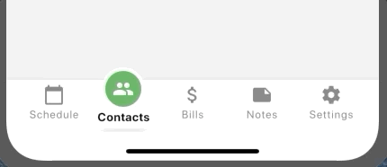

# ff_navigation_bar
A highly configurable navigation bar with emphasis for the selected item.


## Add dependency
```
dependencies:
  ff_navigation_bar: ^0.1.5
```

## Basic use
```
import 'package:flutter/material.dart';
import 'package:ff_navigation_bar/ff_navigation_bar.dart';
...
    return Scaffold(
      appBar: AppBar(
        title: Text(widget.title),
      ),
      body: Center(
        child: Column(
          mainAxisAlignment: MainAxisAlignment.center,
          children: <Widget>[
            Text(
              'Demonstration',
            ),
          ],
        ),
      ),
      bottomNavigationBar: FFNavigationBar(
        borderRadius: BorderRadius.only(topLeft: Radius.circular(16), topRight: Radius.circular(16)), //optional
        theme: FFNavigationBarTheme(
          barBackgroundColor: Colors.white,
          selectedItemBorderColor: Colors.yellow,
          selectedItemBackgroundColor: Colors.green,
          selectedItemIconColor: Colors.white,
          selectedItemTextStyle: TextStyle(fontSize:12),     
        ),
        selectedIndex: selectedIndex,
        onSelectTab: (index) {
          setState(() {
            selectedIndex = index;
          });
        },
        items: [
          FFNavigationBarItem(
            iconData: Icons.calendar_today,
            label: 'Schedule',
          ),
          FFNavigationBarItem(
            iconData: Icons.people,
            label: 'Contacts',
          ),
          FFNavigationBarItem(
            iconData: Icons.attach_money,
            label: 'Bills',
          ),
          FFNavigationBarItem(
            iconData: Icons.note,
            label: 'Notes',
          ),
          FFNavigationBarItem(
            iconData: Icons.settings,
            label: 'Settings',
          ),
        ],
      ),
    );
```

## Theme
The navbar has a Theme class which can be used to define the majority of appearance settings for the navbar and its items.
* barBackgroundColor: The background color for the entire bar (default = white)
* selectedItemBackgroundColor: The background color for the CircleAvatar widget used to display the selected item's icon (default = blueAccent)
* selectedItemIconColor: The color for the selected item's icon (default = white)
* selectedItemBorderColor: The color for the selected item's border (default = white)
* unselectedItemBackgroundColor: The background color for unselected items (default = transparent)
* unselectedItemIconColor: The color for unselected items' icons (default = grey)
* selectedItemTextStyle: The text style to use for the selected item's label. The selectedItemLabelColor takes priority over any color attribute of the style (defaults to size = 13.0, weight = Bold)
* unselectedItemTextStyle: The text style to use for the unselected items' labels (defaults to size = 12.0, weight = Normal)
* barHeight: The height for the bar (which is automatically included within a SafeArea widget)
* itemWidth: The width to use for the selected item CircleAvater (default = 48.0)
* showSelectedItemTopShadow: Shows shadow on top of selected item (default = true)
* showSelectedItemTopShadow: Indicates if the drop shadow below the selected item should be displayed (default = true)

## FFNavigationBar Attributes
* selectedIndex: The item number (zero indexed) which should be marked as selected
* onSelectTab: Callback function to receive tap notifications using the typedef `Function(int selectedIndex)`
* items: List of FFNavigationBarItem objects to be displayed as the bar's items
* theme: A FFNavigationBarTheme theme object
* borderRadius: Border Radius

## FFNavigationBarItem
* label: The String to display as the item's label
* iconData: The IconData to use in the item's Icon
* animationDuration: A Duration object which can be used to tweak the AnimatedContainer behaviour of the navigation bar item.
* selectedBackgroundColor: A Color value which can override the theme's selectedItemBackgroundColor value for a specific navigation bar item (used to create different colors for each item)
* selectedForegroundColor: A Color value which can override the theme's selectedItemIconColor value
* selectedTextStyle: The text style to use for the selected item's label. The selectedItemLabelColor takes priority over any color attribute of the style (defaults to size = 13.0, weight = Bold)
* unselectedTextStyle: The text style to use for the unselected items' labels (defaults to size = 12.0, weight = Normal)

